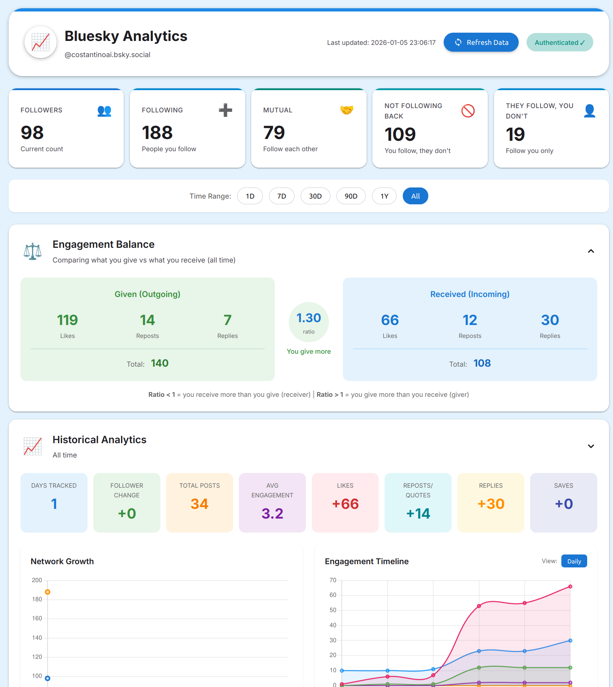
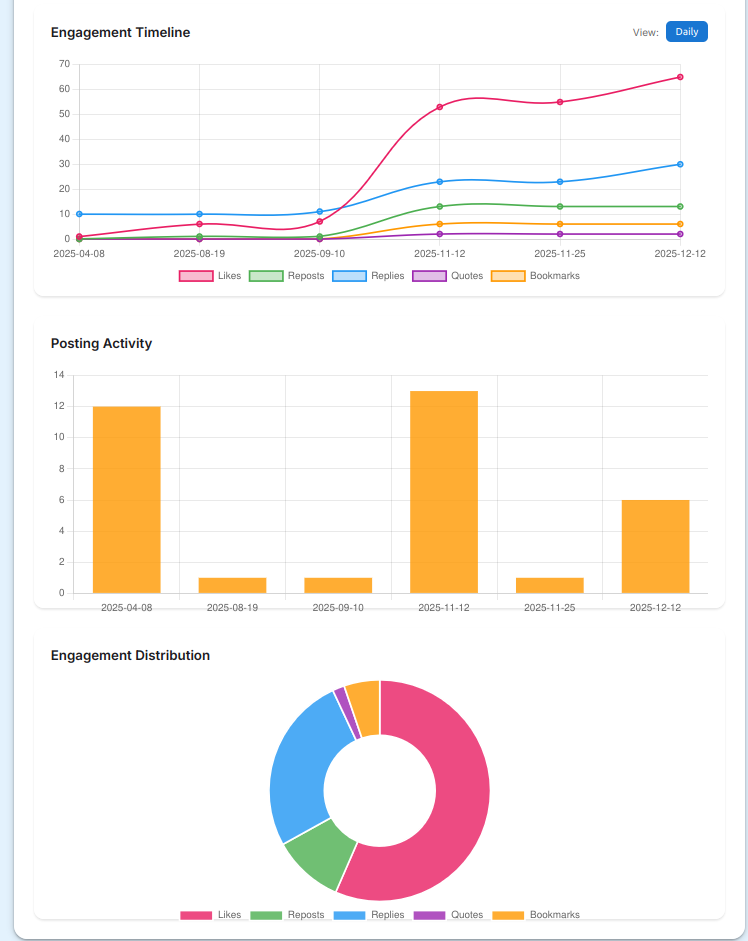
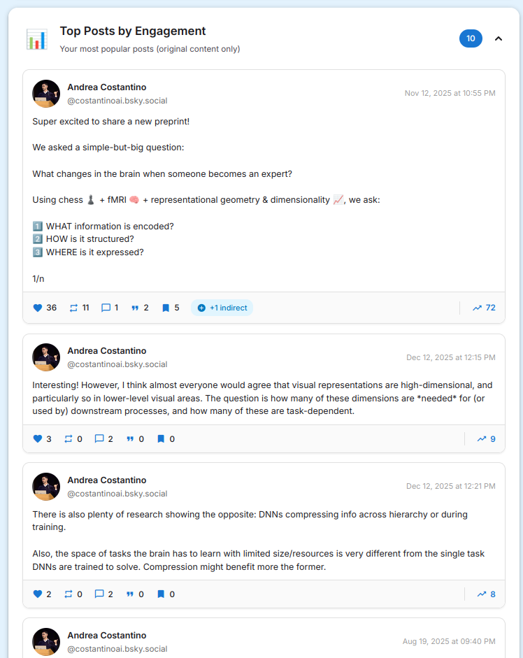
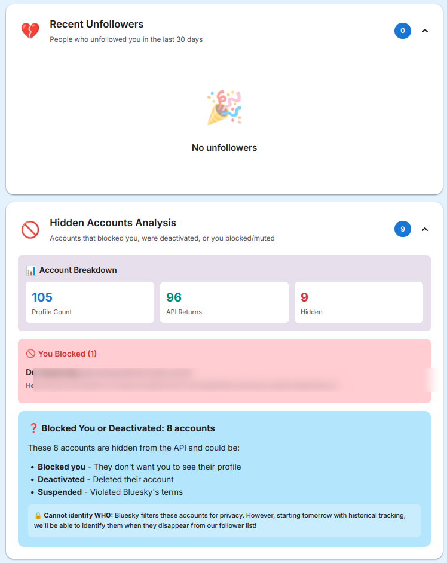
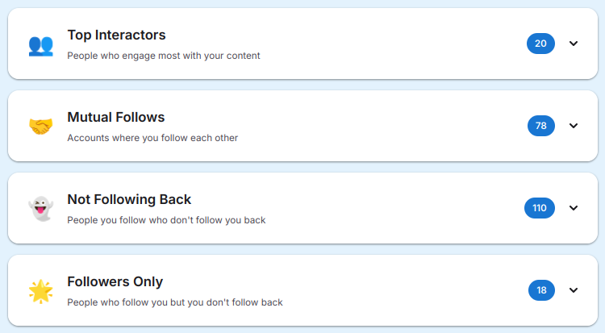

# Bluesky Analytics Tracker

Track your Bluesky follower growth, engagement metrics, and network analytics over time.

[](https://github.com/costantinoai/bluesky-tracker/actions/workflows/test.yml)
[](https://github.com/costantinoai/bluesky-tracker/actions/workflows/docker-build.yml)
[](LICENSE)

---

## Quick Start

```bash
curl -sSL https://raw.githubusercontent.com/costantinoai/bluesky-tracker/main/setup.sh | bash
```

The installer will:
- Check Docker installation
- Download configuration files
- Guide you through setup (handle + app password)
- Start the tracker

**Access dashboard:** http://localhost:8095/report

---

## Screenshots

<details open>
<summary><b>Dashboard Overview</b></summary>


*Main dashboard showing follower/following counts, mutual follows, unfollowers, and key metrics*
</details>

<details>
<summary><b>Historical Analytics & Engagement Timeline</b></summary>


*Track engagement trends over time with interactive charts for likes, reposts, replies, quotes, and bookmarks*
</details>

<details>
<summary><b>Top Posts by Engagement</b></summary>


*View your most popular posts with full text, engagement metrics, and clickable links to Bluesky*
</details>

<details>
<summary><b>Unfollowers & Hidden Accounts</b></summary>


*Track who unfollowed you and analyze hidden accounts (blocked, deactivated, or suspended users)*
</details>

<details>
<summary><b>Network Lists</b></summary>


*Browse mutual follows, non-followers, and followers-only lists*
</details>

---

## What This Tracks

### Network Analytics
- Current follower/following counts
- Mutual follows (people who follow you back)
- Non-mutual follows (you follow, they don't)
- Followers only (they follow, you don't)
- Unfollowers (last 30 days)
- Hidden accounts (blocked, deactivated, or suspended)
- **NEW:** Blocks with timestamps (from CAR files, no auth needed!)

### Post Engagement
- Top posts by engagement score
- Likes, reposts, replies, quotes, bookmarks
- Indirect engagement (engagement on posts that quoted yours)
- Full post text (no truncation)
- Clickable post cards linking to Bluesky

### Engagement Balance (NEW)
- **Engagement Given:** Likes, reposts, and replies you give to others
- **Engagement Received:** Likes, reposts, and replies on your posts
- **Balance Ratio:** See if you're a "giver" or "receiver"
- **Top Accounts:** People you engage with most

### Historical Trends
- Follower/following growth over time
- Engagement timeline charts
- Posting activity patterns
- Engagement distribution breakdown
- **NEW:** Historical timestamps for all data (when you followed someone, when you liked a post)

### Top Interactors (Requires Auth)
- People who engage most with your content
- Tracked from notification data
- **Note:** This feature requires authentication

---

## Important: Database Persistence

**Measurements are only reliable from when you start collecting data.**

- Historical data **cannot** be retrieved before your first collection
- Unfollower tracking starts from your first run
- Keep your database backed up - it contains all historical data
- Run collections daily for accurate trend tracking

**Recommendation:** The built-in scheduler runs daily at 6 AM (see [Scheduling](#scheduling)).

---

## Requirements

### Bluesky App Password (Optional)

**Good news:** Authentication is now **optional**! Most features work without an app password.

**Features that work WITHOUT auth:**
- Follower/following counts and lists
- Post engagement tracking (likes, reposts, replies received)
- Historical data with timestamps (from CAR files)
- Outgoing engagement tracking (likes, reposts you give)
- Blocks (from CAR files)
- Engagement balance comparison

**Features that REQUIRE auth:**
- **Top Interactors** - People who engage with your content (requires notification access)

**To enable all features**, generate an app password:

1. Go to [Bluesky Settings → App Passwords](https://bsky.app/settings/app-passwords)
2. Click "Add App Password"
3. Give it a name (e.g., "Analytics Tracker")
4. Copy the generated password
5. Use it in your `.env` file

**Why app passwords?** They are more secure than your main password and can be revoked anytime.

### System Requirements

**Docker (Recommended):**
- Docker 20.10 or later
- Docker Compose v2.0 or later
- 100MB disk space (database grows with data)
- Runs on: Linux (amd64, arm64, armv7), macOS, Windows

**Install Docker:**
- **Linux**: `curl -fsSL https://get.docker.com | sh`
- **macOS**: [Docker Desktop](https://docs.docker.com/desktop/install/mac-install/)
- **Windows**: [Docker Desktop](https://docs.docker.com/desktop/install/windows-install/)

**Or Python 3.11+ (Alternative):**
- For manual installation without Docker
- See [pip installation](#pip-install-alternative) below

---

## Installation

### Docker Compose (Recommended)

```bash
# Download files
curl -O https://raw.githubusercontent.com/costantinoai/bluesky-tracker/main/docker-compose.selfhost.yml
mv docker-compose.selfhost.yml docker-compose.yml
curl -O https://raw.githubusercontent.com/costantinoai/bluesky-tracker/main/.env.example

# Configure
cp .env.example .env
nano .env  # Add your handle and app password

# Start
docker compose up -d
```

### Docker Run

```bash
# Download and configure .env file
curl -O https://raw.githubusercontent.com/costantinoai/bluesky-tracker/main/.env.example
cp .env.example .env
nano .env  # Add your handle and app password

# Run with .env file
docker run -d \
  --name bluesky-tracker \
  --env-file .env \
  -p 8095:8095 \
  -v $(pwd)/data:/app/data \
  --restart unless-stopped \
  ghcr.io/costantinoai/bluesky-tracker:latest
```

### From Source (Docker)

```bash
git clone https://github.com/costantinoai/bluesky-tracker.git
cd bluesky-tracker
cp .env.example .env
nano .env  # Add your handle and app password
docker compose up -d --build
```

### Pip Install (Alternative)

**For advanced users who prefer manual setup without Docker.**

**Limitations:**
- No automatic scheduler (requires manual cron setup)
- No container isolation or resource limits
- Manual dependency management
- Not recommended for production use

```bash
# Clone repository
git clone https://github.com/costantinoai/bluesky-tracker.git
cd bluesky-tracker

# Create virtual environment
python3 -m venv venv
source venv/bin/activate  # On Windows: venv\Scripts\activate

# Install dependencies
pip install -r requirements.txt

# Configure
cp .env.example .env
nano .env  # Add your handle and app password

# Create data directory
mkdir -p data

# Run application
python app.py
```

**Access:** http://localhost:8095/report

**Manual collection:**
```bash
python collector.py  # Run this daily via cron/task scheduler
```

**Note:** Docker method is strongly recommended for ease of use, automatic scheduling, and better isolation.

---

## Configuration

Edit `.env` file:

```bash
BLUESKY_HANDLE=your-handle.bsky.social  # Required
BLUESKY_APP_PASSWORD=xxxx-xxxx-xxxx-xxxx  # Optional - only needed for Top Interactors feature
PORT=8095  # Web dashboard port
DATABASE_PATH=/app/data/bluesky.db  # Database location
TZ=Europe/Brussels  # Timezone for scheduled collections
```

**Note:** If `BLUESKY_APP_PASSWORD` is not set, the tracker will use public APIs and CAR files for data collection. The dashboard will show "Public API Only" badge instead of "Authenticated".

---

## Scheduling

**Built-in Scheduler (No Setup Required):**

The tracker automatically collects data daily at **6:00 AM** (timezone from your `.env` `TZ` setting) while the container is running. This scheduler runs internally within the application - it doesn't modify any system settings or require external cron jobs.

**How it works:**
- Runs only while the Docker container is active
- No system-level configuration needed
- Automatically stops when container stops
- Configure timezone in `.env` file (`TZ=Europe/Brussels`)

**Optional: Additional Collection Times**

If you want additional collection runs at different times, set up platform-specific scheduling:

### Linux/macOS (Cron)

```bash
crontab -e
```

Add this line (example: daily at 2 AM):
```cron
0 2 * * * docker exec bluesky-tracker python /app/collector.py
```

### Windows (Task Scheduler)

1. Open Task Scheduler
2. Create Basic Task
3. Trigger: Daily at 2:00 AM
4. Action: Start a program
5. Program: `docker`
6. Arguments: `exec bluesky-tracker python /app/collector.py`

### Synology NAS

1. Control Panel → Task Scheduler
2. Create → Scheduled Task → User-defined script
3. Schedule: Daily at 2:00 AM
4. Task Settings → Run command:
   ```bash
   docker exec bluesky-tracker python /app/collector.py
   ```

### Manual Collection

Trigger collection manually anytime:

```bash
# Via Docker exec
docker exec bluesky-tracker python /app/collector.py

# Or via API
curl -X POST http://localhost:8095/api/collect
```

---

## Usage

### Access Points

- **Dashboard**: http://localhost:8095/report
- **API Stats**: http://localhost:8095/api/stats
- **Health Check**: http://localhost:8095/health
- **Prometheus Metrics**: http://localhost:8095/metrics

### New API Endpoints

**Engagement Balance:**
- `GET /api/engagement/balance` - Compare engagement given vs received
- `GET /api/engagement/balance?days=30` - Filter by time period

**Outgoing Engagement:**
- `GET /api/engagement/given` - Likes, reposts, replies you've given
- `GET /api/engagement/given/top-accounts` - Accounts you engage with most

**Historical Data:**
- `GET /api/follows-history` - Following list with timestamps (when you followed)
- `GET /api/posts/stats` - Full post history statistics

**Backfill (CAR Import):**
- `POST /api/backfill` - Import historical data from CAR file
- `GET /api/backfill/history` - View backfill run history

**Auth Status:**
- `GET /api/auth/status` - Check authentication status and available features

### Backup Your Data

**Important:** Your database contains all historical data.

```bash
# Backup
docker cp bluesky-tracker:/app/data/bluesky.db ./backup-$(date +%Y%m%d).db

# Restore
docker cp ./backup-20250101.db bluesky-tracker:/app/data/bluesky.db
docker restart bluesky-tracker
```

---

## Troubleshooting

### Container Won't Start

**Check logs:**
```bash
docker logs bluesky-tracker
```

**Common issues:**

1. **Missing credentials**: Create `.env` file with your handle and app password
2. **Invalid handle**: Use `yourname.bsky.social` (no @ symbol)
3. **Permission errors**: `sudo chown -R $USER:$USER ./data && chmod 755 ./data`

### Authentication Failed

**Error:** `❌ Authentication failed`

**Fix:**
1. Go to https://bsky.app/settings/app-passwords
2. Delete old password, create new one
3. Update `.env` file
4. Restart: `docker compose restart`

### Port Already in Use

**Find what's using port 8095:**
```bash
sudo lsof -i :8095
```

**Change port in `.env`:**
```bash
PORT=9095
docker compose restart
```

### No Data Appearing

**Trigger manual collection:**
```bash
curl -X POST http://localhost:8095/api/collect
```

**Or wait for scheduled collection** (6 AM based on `TZ` setting)

### Database Issues

**Database locked:** Wait a few seconds and retry

**Corrupted database:**
```bash
# Restore from backup
docker compose stop
cp backups/bluesky-YYYYMMDD.db data/bluesky.db
docker compose up -d
```

### Rate Limits

Bluesky API has rate limits. If you hit them:
- Wait 15 minutes
- Retry collection

---

## Security

### App Password Management

**Required:** Use Bluesky app password (not your main password)

1. Generate at: https://bsky.app/settings/app-passwords
2. Store in `.env` file (never commit to git)
3. Set permissions: `chmod 600 .env`
4. Rotate every 90 days

**If compromised:**
1. Revoke at: https://bsky.app/settings/app-passwords
2. Generate new password
3. Update `.env` file
4. Restart container

### Docker Security

**Built-in protection:**
- Non-root user (UID 1000)
- Minimal Alpine Linux base
- No unnecessary packages

**Recommended settings:**

Add to `docker-compose.yml`:
```yaml
services:
  bluesky-tracker:
    security_opt:
      - no-new-privileges:true
    deploy:
      resources:
        limits:
          memory: 256M
          cpus: '0.5'
```

### Network Security

**Local use only:**
```yaml
ports:
  - "127.0.0.1:8095:8095"  # Only accessible from this machine
```

**Public access (HTTPS required):**

Use reverse proxy:
- [Caddy](examples/deployments/docker-compose.caddy.yml) - Zero config HTTPS
- [Traefik](examples/deployments/docker-compose.traefik.yml) - Automatic Let's Encrypt

**Never expose port 8095 directly to internet without HTTPS**

### Data Security

**File permissions:**
```bash
chmod 700 data/
chmod 600 data/bluesky.db
```

**Regular backups:**
```bash
cp data/bluesky.db "backups/bluesky-$(date +%Y%m%d).db"
```

**Privacy:**
- All data stored locally in SQLite
- No external services (except Bluesky API)
- No analytics or tracking
- Delete database to remove all data

---

## Monitoring & Integrations

The tracker exports Prometheus metrics and can integrate with:

- **Grafana** - Visualization dashboards ([example](examples/grafana-dashboard.json))
- **Homepage** - Status widget ([example](examples/homepage-widget.yaml))
- **Uptime Kuma** - Health monitoring ([example](examples/uptime-kuma.json))
- **Traefik/Caddy** - Reverse proxy setups ([examples](examples/deployments/))

See [examples/](examples/) directory for configurations.

---

## Platform Support

| Platform | Architecture | Status |
|----------|-------------|--------|
| Linux x86_64 | amd64 | ✅ Supported |
| Linux ARM64 | arm64 | ✅ Supported (Raspberry Pi 4/5, M1/M2 Macs) |
| Linux ARMv7 | armv7 | ✅ Supported (Raspberry Pi 3) |
| macOS Intel | amd64 | ✅ Supported |
| macOS Apple Silicon | arm64 | ✅ Supported |
| Windows | amd64 | ✅ Supported (via WSL2 or Docker Desktop) |

---

## License

MIT License - see [LICENSE](LICENSE) file for details.

---

## Support

- **Issues**: [GitHub Issues](https://github.com/costantinoai/bluesky-tracker/issues)
- **Discussions**: [GitHub Discussions](https://github.com/costantinoai/bluesky-tracker/discussions)

---

**Note:** This is an unofficial tool and is not affiliated with Bluesky Social PBC.
